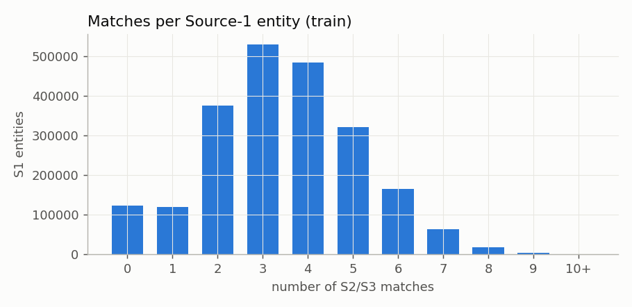
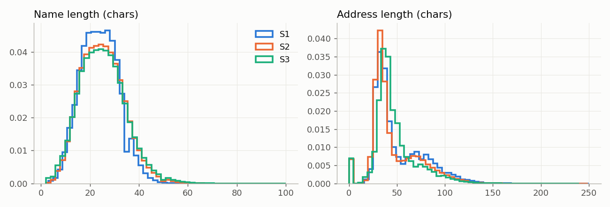
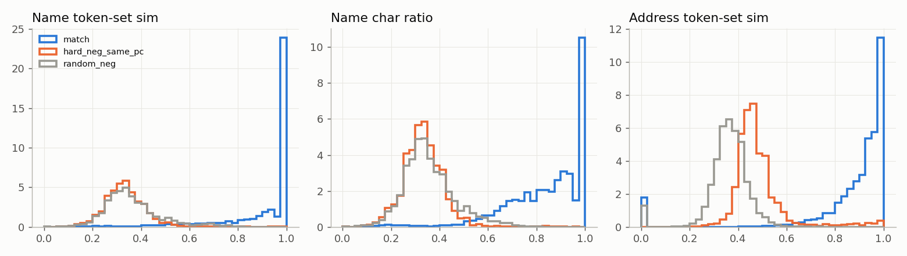

# EDA Report — Business Entity Resolution (Amazon ML Challenge 2026)

Owner: Member 2 (EDA & Preprocessing). Source: `scripts/eda.py` run on the full
train and test sets (13.3 min on a laptop, pandas), plus inspection of the
sample files it writes (`data/interim/eda_output/`, not committed).

> **Correction (also applies to `docs/phase0_inspection_report.md`):** the "postcode"
> statistics from the first EDA pass measured **house numbers**, not postcodes.
> The data contains **no postcodes** (0% of sampled US addresses end in a ZIP,
> 0% of Indian addresses contain a 6-digit PIN). Postcode must not be used as a
> blocking key or feature.

## 1. Files, schema and encoding

| Check | Result |
|---|---|
| Delimiter | TAB. Must read with `sep="\t"` **and quoting disabled** (`quoting=csv.QUOTE_NONE`) — names contain stray `"` and `'` |
| Encoding | UTF-8, no BOM problems observed |
| Source columns | `entity_id`, `business_name`, `business_address`, `country` (all strings) |
| Ground truth columns | `source1_entity_id`, `matched_entity_ids` (comma list, empty for singletons) |
| ID format | `S1-`, `S2-`, `S3-` + integer; 0 duplicate IDs, 0 wrong prefixes |
| GT consistency | every S1 has exactly one GT row; every GT id exists in S2/S3 |

### Row counts

| | Source 1 | Source 2 | Source 3 | Total |
|---|---|---|---|---|
| Train | 2,206,821 | 5,034,616 | 5,285,603 | 12.53M |
| Test | 1,732,544 | 4,887,273 | 5,082,316 | 11.70M |

Total ≈ **24.2M records**. Full-load in pandas works on a laptop but is memory
heavy; the pipeline streams in chunks (see `docs/BENCHMARK.md`).

### Null / missing values

| | S1 | S2 | S3 |
|---|---|---|---|
| Empty name | 0 | 0 | 0 |
| Empty address (train) | 0 | 168,967 (3.4%) | 175,916 (3.3%) |
| Empty address (test) | 0 | 129,408 (2.6%) | 136,098 (2.7%) |
| Empty country | 0 | 0 | 0 |

Additional **placeholder values** occur inside addresses: `null`, `<NULL>`,
`N/A`, `nan` (≈1–2% of sampled S2/S3 rows). They are treated as missing by the
normaliser (`addr_missing = 1` when nothing else remains).

## 2. Countries

| | S1 | S2 | S3 |
|---|---|---|---|
| Train US | 1,323,633 | 3,016,817 | 3,170,056 |
| Train India | 883,188 | 2,017,799 | 2,115,547 |
| Test India | 809,986 (47%) | 2,312,565 | 2,405,000 |
| Test US | 663,106 (38%) | 1,871,330 | 1,945,701 |
| **Test France** | **259,452 (15%)** | 703,378 | 731,615 |

* 100% of true pairs share the country label → safe to block within country.
* France is unseen in training and is 15% of the test S1 set.

## 3. Ground-truth structure

* **Singleton rate 5.58%** (123,247 S1 with no match). "Predict empty for all" scores ≈ 0.056.
* Mean 3.46 matches per S1 (3.67 for non-singletons), max 11.

| matches | 0 | 1 | 2 | 3 | 4 | 5 | 6 | 7 | 8+ |
|---|---|---|---|---|---|---|---|---|---|
| share | 5.6% | 5.4% | 17.0% | 24.1% | 21.9% | 14.6% | 7.5% | 2.9% | 1.0% |

* Most S1 have matches in **both** S2 and S3.
* **0 of 7,638,365** matched S2/S3 records belong to more than one S1 → a hard
  one-to-many constraint: each S2/S3 record maps to at most one S1.
* 26.6% of S2 and 25.4% of S3 records match nothing (distractors).
* Singleton rate and mean matches are identical for India and US.

## 4. Lengths and scripts

| | S1 | S2 | S3 |
|---|---|---|---|
| Name length (median chars / tokens) | 24 / 4 | 25 / 4 | 25 / 4 |
| Address length (median chars / tokens, train) | 41 / 7 | 37 / 6 | 42 / 6 |
| Names with non-ASCII (train) | 0% | 15.2% | 11.5% |
| Addresses with non-ASCII (train) | 0% | 9.5% | 9.0% |
| Names with non-ASCII (test) | 2.4% | 19.0% | 14.5% |

Non-ASCII text is of two kinds:

1. **Indian scripts** (India records): Devanagari (most), Telugu, Kannada,
   Bengali, Tamil, Gujarati, Malayalam, Oriya, Gurmukhi. These are English
   names *written in Indian script*, e.g. `श्री मीडिया प्राइवेट लिमिटेड` =
   "Sree Media Private Limited"; state names too (`महाराष्ट्र`).
2. **Accented Latin**: random accent noise (`Wórldwide`, `Ínc`) and genuine
   French text in the test set (`Général`, `Médical`). S1 train has none.

## 5. Noise catalogue (what the normaliser must undo)

**Names**
* case (S2 ≈ 15–21% ALL CAPS), punctuation, doubled spaces
* legal forms added/dropped/reordered: Pvt/Private, Ltd/Limited, LLC, Inc, Corp,
  L.L.P., P.C.; French SARL, SAS, SASU, EURL, SA, SCI, EI
  (S1 India 84% have a legal suffix vs 49–55% in S2/S3)
* word-order shuffles (`Raka Limited Private Motors`)
* digit-for-letter substitutions (`6eneral`, `We1lness`, `CYPRE5S`, `5W`)
* random accents, letter typos (`Bothrbs`, `Ststloms`)
* trade names — **real name is after the marker**: `Nexnex t/a Raka Motors`,
  `X d/b/a Y`, `X DBA: Y`, `X aka Y`, `X née Y`
* decorations: `| www.site.com`, ` - 1431181809`, prefixes `--`, `***`, `>>`, `@`, `#`,
  honorifics `Mr`, `Smt`, `M/s`, brackets `(LLP)`, `[LP]`, repeated tokens `NQ NQ`
* name is only a domain (`deepeshagri.com`) or initials (`HC`, `SI`)
* name fully replaced by a random brand (`Birch` → `Wexnyla`) — only the address links them

**Addresses**
* abbreviations Rd/Road, St/Street, Dr/Drive, Ave/Avenue, Mt/Mount; wrong
  expansion `St → SAINT`
* US states as code or name (`NC` / `North Carolina`), Indian state codes
  (`MH`, `DL`, `GJ`) and native-script state names
* French region vs department for the same place (`Nouvelle-Aquitaine` vs `Gironde`)
* component reordering, missing components, placeholder segments
* house numbers: `#`, leading zeros (`00111`), ranges (`242-244`), sometimes changed (`Flat 102` vs `902`)
* city typos (`Lafyette`, `FILLMMORE`, `ROSEH ILL`), `City Of X`, `X Town`
* landmarks (`Near`, `Opp`) in ≈10% of Indian addresses, never in US

## 6. Signal strength (100k true pairs vs 50k random and 5.6k hard non-pairs; "hard" = shares a house number)

| raw similarity (lowercase only) | true match | random non-match | hard non-match |
|---|---|---|---|
| exact same name | 0.26 | 0 | 0 |
| name token-set | 0.91 | 0.36 | 0.33 |
| first name word equal | 0.73 | 0.00 | 0.00 |
| address token-set | 0.87 | 0.36 | 0.48 |

* 5% of true matches have name token-set < 0.53, 1% < 0.23 → the address must
  carry them; the reverse holds for empty addresses. Need a combined model.
* India names are harder (first word equal 61% vs 81% US); US addresses harder.
* S3 addresses are noisier than S2 (0.85 vs 0.90).

## 7. After normalisation (held-out half of the EDA sample)

`scripts/eval_normalization.py`, vocab learned on the other half:

| mean similarity of TRUE matches | before | after |
|---|---|---|
| name (all pairs) | 0.849 | **0.925** |
| name (other side in Indian script) | 0.146 | **0.794** |
| address | 0.853 | **0.932** |
| share of pairs with name sim ≥ 0.9 | 67.3% | **79.1%** |

Non-matches stay low (name 0.30, address 0.32).

## 8. Implications for downstream members

1. Block within country; never across.
2. Enforce "each S2/S3 record → at most one S1" at decision time.
3. Most S1 have 3–4 matches: recall matters as well as precision.
4. Use both name and address features; neither alone is enough for ~5–10% of pairs.
5. No postcodes; use house numbers + street words + locality words.
6. Keep France in mind: features must be language-agnostic (character level,
   phonetic keys, token overlap) rather than US/India-specific rules.
7. Blocking-key recall and block sizes: `docs/BLOCKING_KEYS.md` (generated by
   `python -m src.preprocessing.blocking_keys`).
8. The Phase-1 baseline blocking pass 4 ("postcode") in `src/blocking/multi_pass_blocking.py`
   actually blocks on house numbers - recommend replacing it with the keys in `BLOCKING_KEYS.md`.
